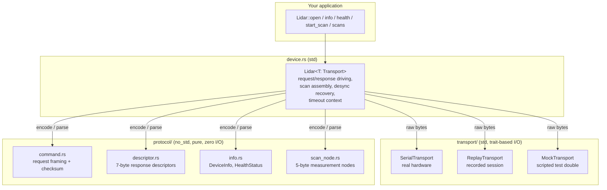
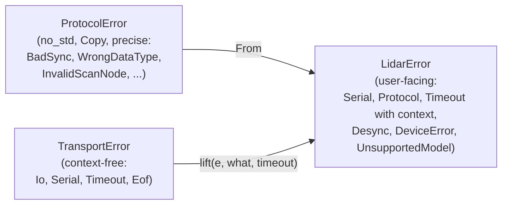
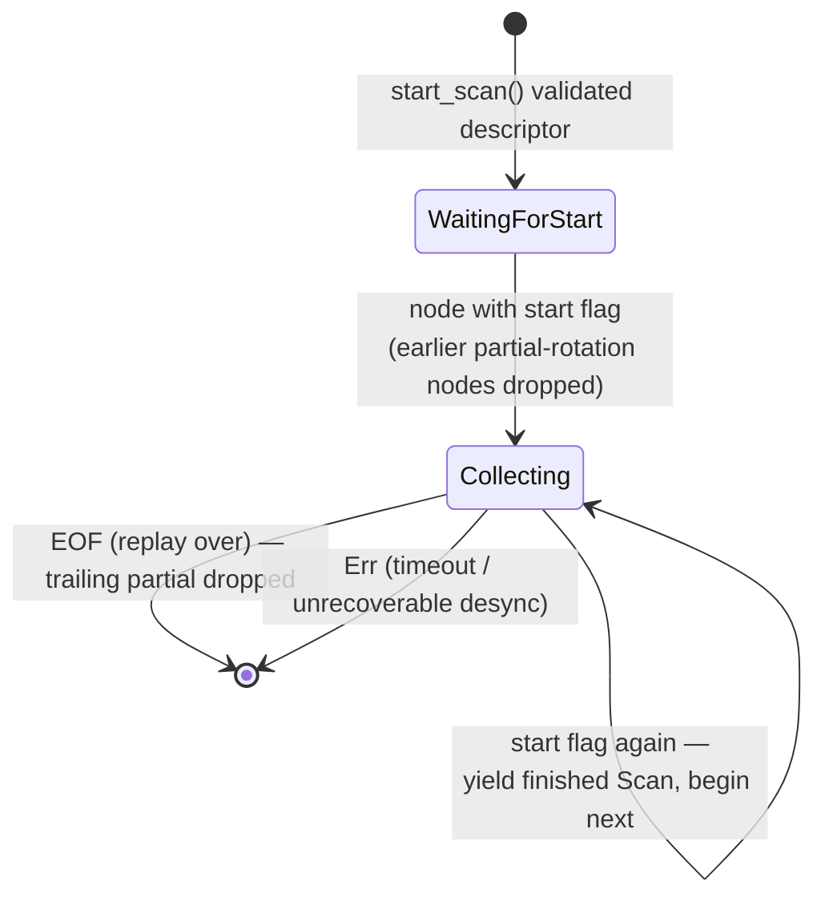
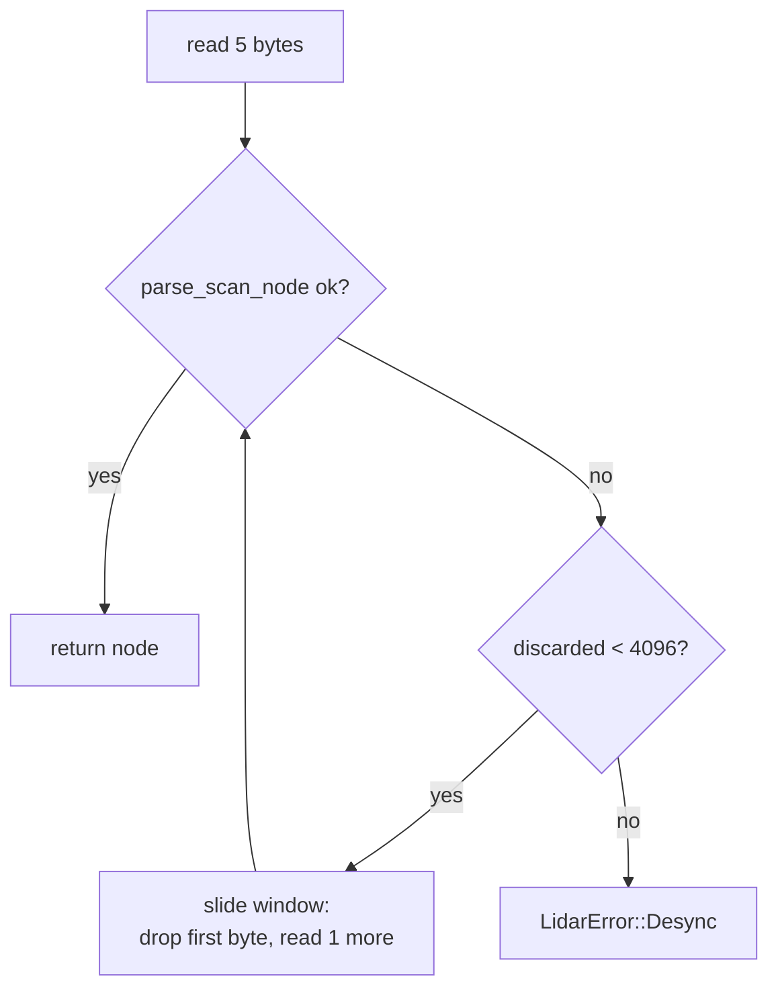

# 02 — Architecture

## The single most important decision

**Protocol parsing is separated from I/O.** Everything else follows from this.



Consequences, all intentional:

- CI runs the complete parser and driver test suite with no hardware attached.
- A recorded session (`ReplayTransport`) exercises the exact same
  `device.rs` code path as a live serial port — replay is not a simulation,
  it is the driver.
- Adding a transport (TCP, UDP, ESP32 UART) is a new `Transport` impl, not a
  rewrite.
- The `protocol/` module compiles under `no_std`
  (`cargo check --no-default-features`).

## File map

| File | Responsibility | Feature gate |
|---|---|---|
| `src/lib.rs` | Crate docs, re-exports, `no_std` attribute | — |
| `src/protocol/mod.rs` | `ProtocolError` (all variants `Copy`, no allocation) | always |
| `src/protocol/command.rs` | `Command` enum, opcodes, `encode()` framing, XOR checksum | always |
| `src/protocol/descriptor.rs` | `ResponseDescriptor`, `SendMode`, `parse_descriptor`, data type constants | always |
| `src/protocol/info.rs` | `DeviceInfo`, `HealthStatus`, `parse_device_info`, `parse_health` | always |
| `src/protocol/scan_node.rs` | `ScanNode`, `parse_scan_node`, `could_start_node` | always |
| `src/types.rs` | `Point`, `Scan` (std); re-exports `DeviceInfo`/`HealthStatus` | partial |
| `src/transport/mod.rs` | `Transport` trait, `TransportError`, blanket `Box<dyn Transport>` impl | `std` |
| `src/transport/serial.rs` | `SerialTransport`, port auto-detection helpers | `std` |
| `src/transport/replay.rs` | `ReplayTransport` (recorded bytes; EOF ends the stream) | `std` |
| `src/transport/mock.rs` | `MockTransport` (queued reads, captured writes) | `std` |
| `src/device.rs` | `Lidar`, `LidarConfig`, `Scans` iterator, desync recovery | `std` |
| `src/error.rs` | `LidarError` (top-level, user-facing) | `std` |

Examples (`examples/`) are the hardware test suite; tests
(`tests/protocol_tests.rs`) are the no-hardware integration suite; recorded
fixtures live in `tests/fixtures/`.

## The Transport trait

```rust
pub trait Transport {
    fn write_all(&mut self, bytes: &[u8]) -> Result<(), TransportError>;
    fn read_exact(&mut self, buf: &mut [u8], timeout: Duration) -> Result<(), TransportError>;
    fn read(&mut self, buf: &mut [u8], timeout: Duration) -> Result<usize, TransportError>;
    fn discard_input(&mut self) -> Result<(), TransportError>;
}
```

Design decisions worth remembering:

- **Per-call timeouts, not transport state.** The device layer needs
  different budgets for different waits (a scan's first node needs seconds,
  later nodes need milliseconds). `SerialTransport` caches the last applied
  timeout and only calls the OS `set_timeout` when the value changes.
- **`read` (partial) exists deliberately.** `examples/record.rs` must be a
  dumb byte sink that captures descriptors and any garbage verbatim;
  `read_exact` alone would bake framing assumptions into the recorder.
- **`read` never returns `Ok(0)`.** No data within the timeout is
  `Err(Timeout)`; a finished byte source is `Err(Eof)`. This makes "silent
  device" and "recording over" distinct, which the scan iterator relies on
  (EOF ends iteration cleanly; timeout is an error with context).
- **Object safety.** All methods take `&mut self` with no generics, and a
  blanket `impl Transport for Box<T: Transport + ?Sized>` means
  `Lidar<Box<dyn Transport>>` works while `Lidar<SerialTransport>` stays
  zero-cost.

## Error architecture (three tiers)



The key subtlety: `TransportError::Timeout` carries no context because the
transport cannot know what the caller was waiting for. `device.rs` upgrades it
via a private `lift()` helper into
`LidarError::Timeout { what: "device info descriptor", ms: 1000 }`. There is
deliberately no `From<TransportError> for LidarError` so this context can
never be silently skipped.

## Scan assembly and desync recovery

`Lidar::scans()` returns an iterator that assembles complete 360-degree
rotations from the node stream:



Every node read goes through byte-level resynchronization. The 5-byte node
format carries three redundancy bits (start flag, inverted start flag, check
bit); if they are inconsistent, the stream is misaligned:



Two properties of this algorithm are pinned by integration tests
(`tests/protocol_tests.rs`):

- Garbage bytes *between* nodes cost **zero** real measurements — the window
  slides past exactly the garbage and realigns on the next node.
- A corrupted byte *inside* a node costs **exactly one** measurement — the
  destroyed node is dropped and the stream realigns on the following one.

## Feature gating (`std` / `no_std`)

- `default = ["std"]`; `std = ["dep:serialport", "thiserror/std"]`.
- `protocol/` always compiles. `transport/`, `device.rs`, `error.rs`, and the
  `Point`/`Scan` half of `types.rs` are `#[cfg(feature = "std")]`.
- `DeviceInfo` and `HealthStatus` are *defined* in `protocol/info.rs` (the
  parsers must produce them under `no_std`) and *re-exported* from `types.rs`
  and the crate root, so the public API matches the spec while honoring the
  purity rule. This is a deliberate, documented deviation from the spec's
  file layout.
