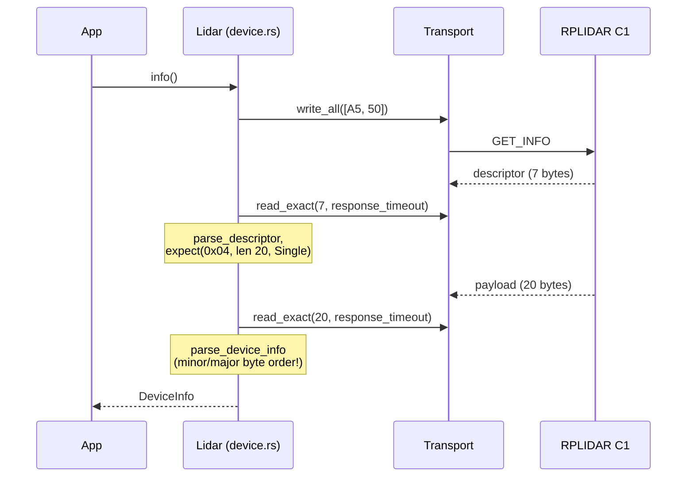
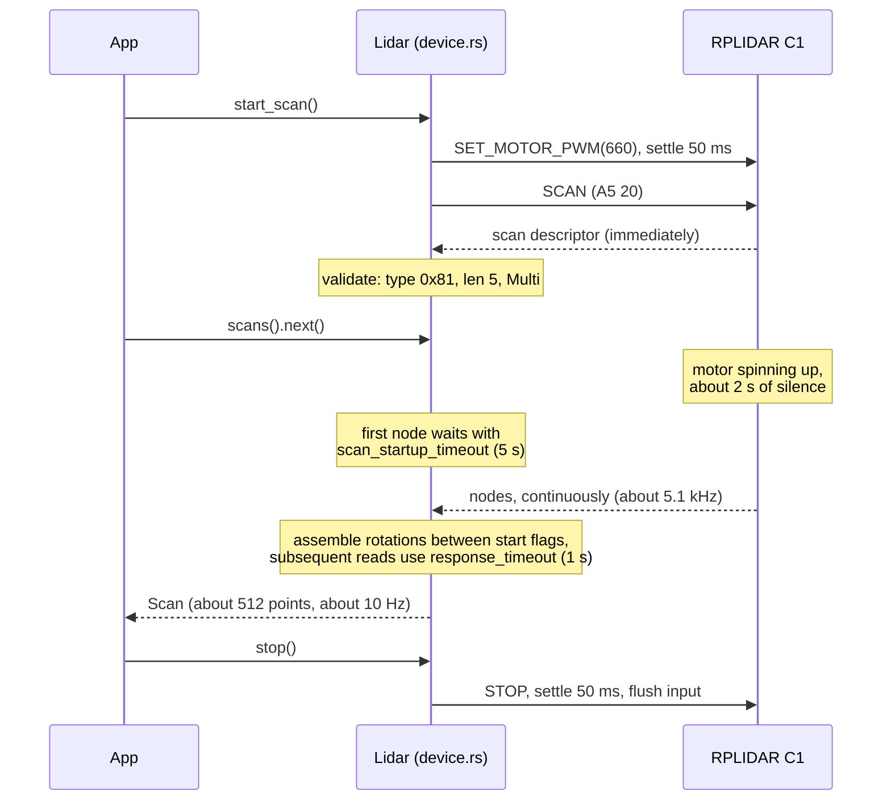

# 03 — The RPLIDAR wire protocol

Everything in this document was cross-checked against three sources: the
SLAMTEC public protocol specification, the reference `rplidar_sdk` headers
(`sl_lidar_cmd.h`), and — most importantly — bytes recorded from a real
RPLIDAR C1 (`tests/fixtures/c1_*.bin`). Where sources disagreed, the real
device won.

## Connection

| Model | Baud | Notes |
|---|---|---|
| C1 | 460800 | primary target, verified |
| A1 | 115200 | future |
| A2/A3/S1/S2 | 256000 | future |

8 data bits, no parity, 1 stop bit, no flow control. The C1 presents as a
CP210x USB bridge (VID `0x10C4`, PID `0xEA60`); some adapters use CH340
(`0x1A86:0x7523`).

## Requests

Every request starts with the sync byte `0xA5` followed by an opcode.
Commands with a payload append a length byte, the payload, and a checksum
that is the XOR of every preceding byte in the frame.

```text
without payload:  0xA5  <opcode>
with payload:     0xA5  <opcode>  <len>  <payload ...>  <xor checksum>
```

| Command | Opcode | Payload | Response | Implemented in |
|---|---|---|---|---|
| STOP | `0x25` | none | none | `Command::Stop` |
| RESET | `0x40` | none | unframed ASCII boot banner | `Command::Reset` |
| SCAN | `0x20` | none | multi (5-byte nodes) | `Command::Scan` |
| GET_INFO | `0x50` | none | single, 20 bytes | `Command::GetInfo` |
| GET_HEALTH | `0x52` | none | single, 3 bytes | `Command::GetHealth` |
| GET_SAMPLERATE | `0x59` | none | single, 4 bytes | `Command::GetSampleRate` (no device method yet) |
| SET_MOTOR_PWM | `0xF0` | u16 LE, 0..=1023 | none | `Command::SetMotorPwm(u16)` |
| EXPRESS_SCAN | `0x82` | 5 bytes | multi (84-byte capsules) | future work |
| GET_LIDAR_CONF | `0x84` | varies | single | future work |

Worked checksum example (pinned in unit tests):
`SetMotorPwm(660)` — 660 = `0x0294`, little-endian payload `[0x94, 0x02]`:

```text
frame:    A5  F0  02  94  02  C1
checksum: 0xA5 ^ 0xF0 ^ 0x02 ^ 0x94 ^ 0x02 = 0xC1
```

## Response descriptor (7 bytes)

Every framed response is preceded by a descriptor:

```text
byte 0    byte 1    bytes 2..6 (u32 little-endian)      byte 6
0xA5      0x5A      [ len: 30 bits ][ send mode: 2 ]    data type
```

- `len` = the packed u32 masked with `0x3FFF_FFFF` (payload length in bytes of
  each following response).
- `send mode` = top 2 bits: `0` single response, `1` multi response (a stream
  follows until STOP); `2`/`3` are reserved and treated as protocol errors.
- Known data types: DEVINFO `0x04` (len 20, single), DEVHEALTH `0x06` (len 3,
  single), SAMPLE_RATE `0x15` (len 4, single), MEASUREMENT `0x81` (len 5,
  multi).

Implemented in `protocol/descriptor.rs` (`parse_descriptor`, plus
`ResponseDescriptor::expect` which validates type/length/mode against what a
request requires).

## GET_INFO response (20 bytes)

```text
offset 0      1        2        3         4..19
       model  fw minor fw major hardware  serial number (16 bytes)
```

**Trap: the firmware version is a little-endian u16 whose LOW byte is the
minor version.** Wire offset 1 is minor, offset 2 is major. At least one
popular community driver decodes this wrong. `parse_device_info` returns
`firmware_version: (major, minor)` and a unit test pins the byte order.

The C1 reports model `0x41`. Real values from the development unit: firmware
1.02, hardware revision 18, serial rendered as 32 uppercase hex characters.

## GET_HEALTH response (3 bytes)

```text
offset 0       1..2
       status  error code (u16 LE)
```

Status `0` = Good, `1` = Warning(code), `2` = Error(code); anything else is
`ProtocolError::InvalidHealthStatus`. Note that `Lidar::health()` returns an
unhealthy status as a *value*, not an `Err` — querying the health of a sick
device is a successful query.

## Standard scan measurement node (5 bytes)

```text
byte 0:  [ quality: 6 bits ][ !S: 1 ][ S: 1 ]     S = start-of-rotation flag
byte 1:  [ angle low 7 bits           ][ C: 1 ]   C = check bit, always 1
byte 2:  [ angle high 8 bits ]
byte 3:  [ distance low 8 bits ]
byte 4:  [ distance high 8 bits ]
```

Decoding (implemented in `protocol/scan_node.rs`):

```text
angle_q6    = (byte2 << 7) | (byte1 >> 1)     angle_deg   = angle_q6 / 64.0
distance_q2 = (byte4 << 8) | byte3            distance_mm = distance_q2 / 4.0
quality     = byte0 >> 2
start_flag  = byte0 & 0x01
```

Validity invariants: `S != !S` and `C == 1`. If either fails the stream is
desynchronized; the reader discards one byte and retries (see
[02-architecture.md](02-architecture.md) for the recovery algorithm). A
distance of 0 means no return — the point is kept in the raw `Scan` but
filtered by `valid_points()`.

## A complete session, as sequence diagrams

Info round trip:



Scan session, including the C1's motor spin-up behavior (discovered on real
hardware — see [06-hardware-notes.md](06-hardware-notes.md)):



## Timing constants (LidarConfig)

These come from a proven working Python driver for the same physical unit and
from direct measurement; they are field-tested, not guesses.

| Constant | Default | Why |
|---|---|---|
| `response_timeout` | 1 s | descriptor/payload reads; generous for 460800 baud |
| `stop_settle` | 50 ms | after STOP before the device is reliably idle |
| `motor_settle` | 50 ms | after SET_MOTOR_PWM; starting SCAN earlier can race spin-up |
| `reset_settle` | 500 ms | RESET reboots the device; it prints an unframed ASCII banner that must be flushed |
| `scan_startup_timeout` | 5 s | the C1 sends the scan descriptor instantly but streams no nodes until the motor reaches speed (about 2 s measured) |
| `motor_pwm` | 660 | duty sent by `start_scan`; the C1 self-manages its motor but the command is harmless and A-series units need it |
