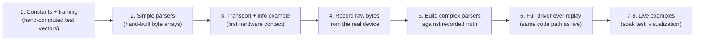

# 04 — Development process

This records how the driver was actually built, in order, including what went
wrong. The order is not incidental — it is a methodology worth repeating for
every future protocol feature.

## The fixture-first methodology



The critical move is step 4 before step 5: the scan parser was **not** written
until real wire bytes existed in `tests/fixtures/`. This means every parser is
developed and regression-tested offline against what the device actually
sends, not against a reading of the datasheet. When adding express scan or a
new model, do the same: extend `examples/record.rs`, capture fixtures, then
parse.

## Step-by-step history

| Step | Delivered | Verified by |
|---|---|---|
| 1 | Cargo skeleton, `ProtocolError`, `Command` framing with XOR checksum | hand-computed vectors, e.g. `SetMotorPwm(660)` → `A5 F0 02 94 02 C1`; clamp test 2000 → 1023 |
| 2 | Descriptor parser, `DeviceInfo`/`HealthStatus` parsers | hand-built arrays; firmware byte-order test; reserved-send-mode and invalid-status rejections |
| 3 | `Transport` trait, `SerialTransport`, `Lidar`, `examples/info.rs` | real C1 printed its serial number, firmware 1.02, health Good |
| 4 | `examples/record.rs` raw byte capture | three fixtures captured from the real C1 (info 27 B, health 10 B, scan 5063 B / 1011 nodes) |
| 5 | `protocol/scan_node.rs` | unit tests incl. an exhaustive property test (`could_start_node` agrees with the parser for all 256 byte values) |
| 6 | `Point`/`Scan`, `Scans` iterator with desync recovery, `ReplayTransport`, `MockTransport` | integration tests: synthetic sessions, corruption recovery, real-fixture replay |
| 7 | `examples/basic_scan.rs` | 60 s live soak: 583 scans, about 10 Hz, zero desync |
| 8 | `examples/rerun_viz.rs` | live point cloud on the real device; `.rrd` recording |
| 9 | README, CI, docs, cross-compile checks | full gate (below) |

The quality gate that ran after every step:

```sh
cargo fmt --check
cargo clippy --all-targets -- -D warnings   # pedantic is on via [lints]
cargo test
cargo check --no-default-features           # proves the no_std parser core
cargo check --target aarch64-unknown-linux-gnu
```

## Bugs and surprises reality caught (the valuable part)

### 1. The scan-startup timeout (real bug, found on hardware)

The C1 acknowledges `SCAN` with its response descriptor immediately, but
streams no measurement nodes until the motor reaches speed — about two
seconds. The first live `basic_scan` run died with
`timed out waiting for scan node after 1000ms`.

The fix is `LidarConfig::scan_startup_timeout` (default 5 s), applied only to
the *first* node after `start_scan()`; subsequent nodes use the normal 1 s
`response_timeout`. Do not "simplify" this into one timeout: a single long
timeout would make genuine mid-scan stalls take seconds to detect, and a
single short one breaks startup.

The recorder had already shown the symptom ("read stalled" retries for about
2 s after SCAN) before the scan iterator existed — a reminder to treat
recorder output as data about the device, not just noise.

### 2. macOS: `/dev/cu.*`, never `/dev/tty.*`

Opening the `tty.` callin device can block waiting for a carrier signal that
USB bridges never raise. The spec and initial instructions both said
`tty.usbserial-*`; the proven Python driver for this exact unit used `cu.*`
deliberately. The library helper `transport::prefer_callout_device` rewrites
`tty.` to `cu.` on macOS, and port auto-detection prefers `cu.*` throughout.

### 3. The firmware version byte order

The GET_INFO firmware field is a little-endian u16 with minor in the low
byte. Decoding it as major-first produces plausible-looking but wrong
versions, and at least one community driver has this bug. Pinned by a unit
test with asymmetric bytes (`[.., 0x19, 0x01, ..]` must parse as 1.25).

### 4. Desync recovery is better than expected — and tests must reflect it

An early integration test assumed injected garbage would cost one measurement.
It costs zero: the sliding-window resync consumes exactly the garbage bytes
and realigns on the next genuine node. The test suite now pins both cases
precisely (garbage between nodes: zero loss; corruption inside a node: exactly
one node lost). When a test fails, first ask whether the code or the
expectation is wrong.

### 5. The STOP-on-open handshake

If a previous process crashed mid-scan, the C1 keeps streaming forever and
the next open() reads scan bytes where it expects descriptors. `Lidar::open`
therefore always sends STOP, waits 50 ms, and flushes input before doing
anything else — making open idempotent regardless of what died before it.

### 6. Viewer/SDK version alignment (rerun)

rerun makes no cross-version compatibility guarantees yet. The dev-dependency
and the installed viewer binary must match minor versions
(`rerun = "0.34"` with `uv tool install rerun-sdk==0.34.1`) or the viewer
prints a mismatch warning. Documented in the README's Visualization section.

## Deviations from the original spec (CLAUDE.md), all deliberate

| Spec said | Built instead | Why |
|---|---|---|
| `DeviceInfo`/`HealthStatus` defined in `types.rs` | defined in `protocol/info.rs`, re-exported from `types.rs` and crate root | the `no_std` parsers must produce these types; public API is unchanged |
| top-level `LidarError::Checksum` variant | `LidarError::Protocol(ProtocolError::Checksum { .. })` | single source of truth; identical display text |
| `rerun = "0.33"` dev-dependency | `0.34` | matches the installed viewer; rerun has no cross-version guarantees |
| `LICENSE-MIT` + `LICENSE-APACHE` dual license | single MIT `LICENSE` exists today | open decision, must be resolved before crates.io publish |
