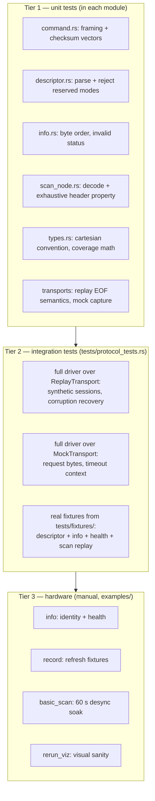

# 05 — Testing strategy

Three tiers. The first two run in CI with no hardware and must stay that way:
never gate CI on a device, never write a test that needs one.

## Tier 1 — unit tests

Live in `#[cfg(test)]` modules next to the code. Notable ones:

- **Hand-computed frame vectors** in `command.rs`: every opcode, plus the
  `SetMotorPwm` checksum worked out by hand in a comment, plus a clamp test.
  If framing ever changes, these fail loudly with the exact bytes.
- **The exhaustive header property** in `scan_node.rs`:
  `could_start_node(b)` must agree with `parse_scan_node` for all 256 values
  of the first byte. Cheap total coverage of the resync fast path.
- **Firmware byte order** in `info.rs`: asymmetric bytes so a swapped decode
  cannot pass.
- **Cartesian convention** in `types.rs`: ahead is `(d, 0)`, device-right is
  negative y — pinned so the x-forward/y-left frame cannot silently flip.

## Tier 2 — integration tests

`tests/protocol_tests.rs` drives the *public API only*, over the two offline
transports. Key ideas:

- `instant_config()` zeroes all settle sleeps so the suite stays fast.
- A `node(start, quality, angle, distance)` helper synthesizes wire-exact
  5-byte nodes, and `synthetic_session` builds descriptor + N rotations.
- **Desync recovery is pinned byte-exactly**:
  - `garbage_between_nodes_recovers_every_node` — 3 junk bytes between nodes
    cost zero measurements.
  - `corrupted_node_is_dropped_and_stream_recovers` — an in-place destroyed
    header costs exactly one measurement, and later rotations are untouched.
- **The mock proves wire behavior, not just results**: after `info()` +
  `health()`, the transport must have received exactly
  `A5 50 A5 52` — nothing more, nothing reordered.
- **Timeout context is asserted**: a silent device must produce
  `Timeout { what: "device info descriptor", ms: 10 }`, not a bare timeout.

## Real-hardware fixtures

`tests/fixtures/` holds verbatim wire captures made by
`cargo run --example record` on a real C1:

| File | Contents |
|---|---|
| `c1_info_response.bin` | 7-byte descriptor + 20-byte GET_INFO payload (27 B) |
| `c1_health_response.bin` | descriptor + 3-byte GET_HEALTH payload (10 B) |
| `c1_scan_1000_nodes.bin` | scan descriptor + about 1000 raw nodes (5063 B) |

The `real_*` tests parse these and replay the scan capture through the full
driver. They are written to **skip gracefully when the files are absent** (a
fresh clone before any recording, or CI without committed fixtures) — they
print a note and pass trivially, so hardware never gates CI, but the moment
fixtures exist they become strict.

To refresh fixtures after a firmware update or for a new unit:
`cargo run --example record` (options: `--nodes`, `--seconds`, `--out`).

## Tier 3 — hardware examples

The examples are the manual test suite; each prints output that makes success
obvious:

- `info` must print the real serial number and `Health: Good`.
- `basic_scan -- --seconds 60` must end with `... with no desync.` and hold
  roughly 10 Hz / 500+ points per scan on a C1.
- `rerun_viz` must show a recognizable room outline.

## CI (.github/workflows/ci.yml)

Three jobs on every push/PR:

1. `fmt --check`, `clippy --all-targets -- -D warnings` (pedantic via
   `[lints]`), `cargo test`, `cargo check --no-default-features`.
2. MSRV job: `cargo check --all-features` on Rust 1.85.
3. Cross job: `cargo check --target aarch64-unknown-linux-gnu` (Raspberry Pi
   deployment target).

## Rules to keep

- New protocol feature: record fixtures first, then write the parser, then
  add corrupted variants of those fixtures for recovery tests.
- If a test fails after a behavior investigation, decide explicitly whether
  the code or the expectation is wrong (see the desync case in
  [04-development-process.md](04-development-process.md)).
- Keep `unwrap`/`expect` confined to tests and examples; library code bubbles
  errors with `?`.
